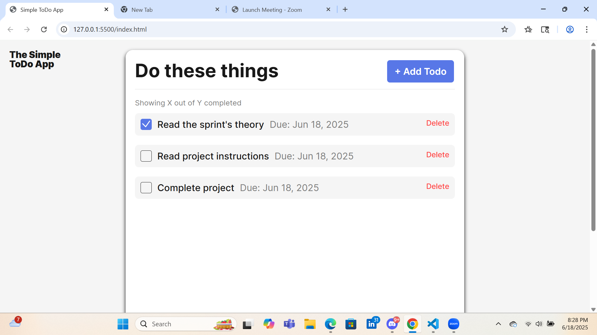
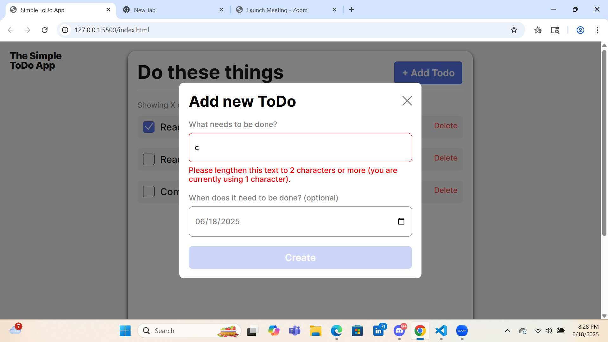

# Simple Todo App

Its a simple ToDO app where initiallyt the page is getting loaded with some todos. And later i can add a todo and delete a todo

## Functionality

Initially the project is loaded with some todos that are already defined. I can add a todo and when adding a todo, if the todo name field is empty or string length is short it is giving an error message and the create button becomes inactive accordingly.
Also there is a check box for every todo to show if it is completed already.

## Technology

It has been built with HTML, CSS and javascript. In css, I have used BEM for class naming, and in js I have used class based appraoch.

## Deployment

This project is deployed on GitHub Pages and the link is below:

- https://samir-kumar-roy.github.io/se_project_todo-app/
